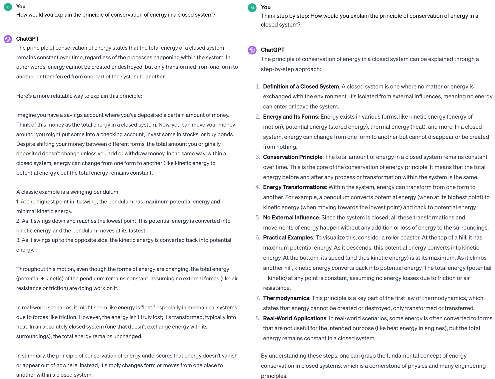
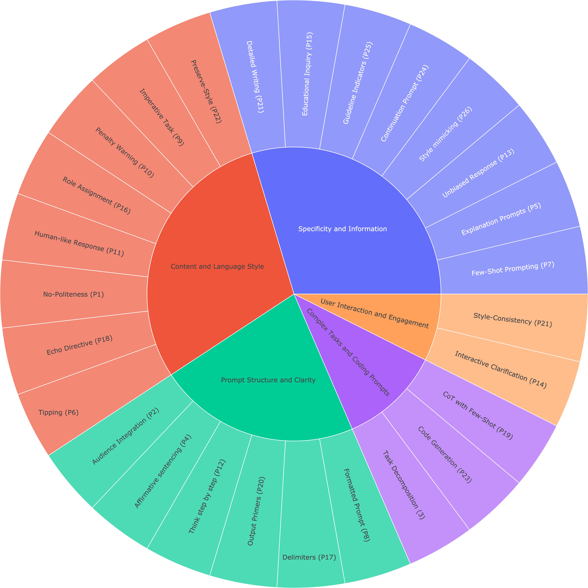

<p align="center" width="100%">

</p>

[](https://github.com/aidarmyrzakhan/Atlas-A-LLM-Inquiry-Principle-Benchmark/blob/main/LICENSE.md)
[](https://www.python.org/downloads/release/python-390/)
[](https://github.com/psf/black)

# ATLAS: An LLM Inquiry Principle Benchmark

This repository contains resources and research on formulating effective queries and prompts for large language models (LLMs). The primary contribution is the introduction of 26 guiding principles aimed at optimizing interactions with LLMs of various scales, such as LLaMA-1/2, GPT-3.5, and GPT-4.

[//]: # (![demo]&#40;assest/demo.png | width=100&#41;)
[](./assets/demo.png)

## Overview

Our work aims to simplify the underlying concepts of formulating questions for different scales of large language models. By examining their abilities and enhancing user comprehension, we focus on optimizing the design of instructions and prompts. Extensive experiments conducted on models like LLaMA-1/2 and GPT-3.5/4 have verified the effectiveness of the proposed principles. 

[//]: # (![distribution]&#40;assets/distribution.png | width=100&#41;)
[](./assets/distribution.png)

## Data Release

Our dataset, comprising 13k data points, supports the study of LLM prompting principles. The data is curated to facilitate understanding and application of the [`26 principles`](./data/README.md). 
Our project includes two types of datasets, catering to different needs and research focuses:

   1. **General Dataset (`general_dataset.json`)**: This comprehensive dataset combines all the examples from each of the 26 principles into a single file, offering a holistic view of our research and its diverse applications.
   
      - File: [`general_dataset.json`](./data/general_dataset.json)
      - Structure:
        - Each entry contains an `Instruction` field describing the task.
        - The `{model_name}_conversations` field provides the model-generated response to the instruction.
   
      Example:
      ```json
      {
         "id": "identity_0",
         "model": "gpt4",
         "conversations": [
           {
             "from": "human",
             "value": "Explain the process of photosynthesis."
           },
           {
             "from": "gpt",
             "value": "Photosynthesis is a biochemical process..."
           }
         ]
       },
   
   2. **Individual Principle Datasets**: We offer separate datasets for [`boosting`](./data/principles/boosting) and [`correctness`](./data/principles/correctness) for each of the 26 principles for a more focused study. These files allow researchers to explore and analyze data of specific principles in isolation.

## Principled Instruction Finetuning

Our benchmark is compatible with [Stanford Alpaca](https://github.com/tatsu-lab/stanford_alpaca) or [FastChat](https://github.com/lm-sys/FastChat). We will further provide the finetuned models.

## Third-party Apps

1. [Prompt Enhancer](https://prompt-enhancer.streamlit.app ) and its [GitHub](https://github.com/lim-hyo-jeong/Prompt-Enhancer) is a web service and tool designed to enable users to select specific principles to enhance the prompts. Special thanks to [Lim Hyo Jeong](https://github.com/lim-hyo-jeong/) for the excellent contribution!

2. [Magic Prompts](https://magicprompts.lyzr.ai/) is an easy tool to generate high-quality prompts. Special thanks to [Lyzr](https://www.lyzr.ai/) for the excellent contribution!

3. [Prompt-builder](https://promptbuilder.streamlit.app/) and its [GitHub](https://github.com/lypsoty112/Prompt-builder) is a small Python tool and application that allows users to generate natural language prompts adhering to specific rules and guidelines defined in our paper. Special thanks to [lypsoty112](https://github.com/lypsoty112) for the excellent contribution!


## Citation

```
@article{bsharat2023principled,
  title={Principled Instructions Are All You Need for Questioning LLaMA-1/2, GPT-3.5/4},
  author={Sondos Mahmoud Bsharat, Aidar Myrzakhan, Zhiqiang Shen},
  journal={arXiv preprint arXiv:2312.16171},
  year={2023},
}
```

## Contributing
We welcome contributions and suggestions to improve our principles and expand the dataset.

## Acknowledgements

[Stanford Alpaca](https://github.com/tatsu-lab/stanford_alpaca)
